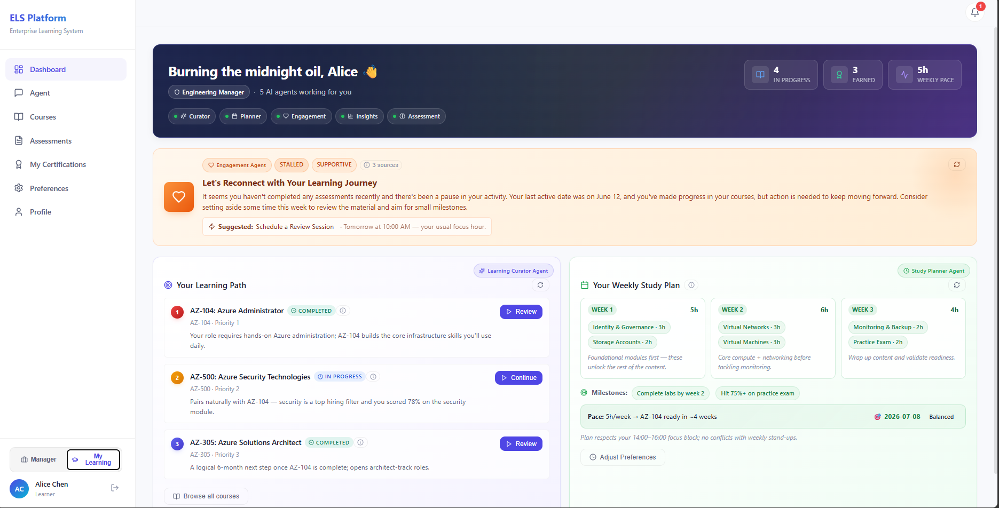

# Enterprise Learning System (ELS)

> AI-powered, multi-agent enterprise learning platform built for the **Microsoft Foundry "Reasoning Agents" Hackathon Track**.

ELS turns a static course catalog into a personalised learning surface. A single
**Foundry orchestrator agent** routes each user request to one of five
specialist agents (curator, assessment, planner, engagement, manager-insights)
over the **A2A** protocol, grounded in MongoDB through **MCP** and in
certification material through a **Foundry IQ** knowledge base.



### 📹 Demo Video

[](https://youtu.be/zq8fesZbrlU?si=Y9T8zKn8AMurSxQ8&t=1)

▶️ [**Watch on YouTube**](https://youtu.be/zq8fesZbrlU?si=Y9T8zKn8AMurSxQ8&t=1)

📁 [**Local video**](ELS-VideoDemo.mp4)

> More UI screenshots in [`preview-images/`](preview-images/).

---

## Table of Contents

1. [Overview](#overview)
2. [Setup](#setup)
3. [Architecture](#architecture)
4. [Services](#services)
5. [Multi-Agent System](#multi-agent-system)
6. [Data Model](#data-model)
7. [Frontend](#frontend)
8. [MCP Server](#mcp-server)
9. [Observability](#observability)
10. [Demo Credentials](#demo-credentials)
11. [Repository Layout](#repository-layout)

---

## Overview


**What it does**

- **Learners** get a personalised dashboard: course recommendations, a weekly
  study plan respecting their meeting / focus hours, motivational nudges, and
  proctored practice assessments with grounded, citable explanations.
- **Managers** get a team readiness view: who is on track, who is at risk, and
  what specific actions to take.
- **Admins** manage the catalog (courses, modules, topics, skills, roles, job
  levels) and operate the system through a built-in observability surface
  (RAID-correlated request logs, live log stream, telemetry explorer).

**How it works (one paragraph)**

Each user message hits the **Gateway**, which authenticates the JWT and proxies
to one of three internal services: **Core** (auth, users, schedules, chat
history, notifications), **Admin** (catalog CRUD + telemetry), or
**Orchestrator** (AI). The Orchestrator drives a single Foundry agent
(`els-orchestrator`) which, using only MCP tools, fetches just enough grounding
to pick a route and emits a JSON envelope. The Orchestrator backend forwards
that envelope to the chosen specialist over A2A; specialists may ask for more
data via `subagent_requests` (multi-turn, capped). Final responses are cached
in MongoDB (`agent_cache`) so dashboard cards render instantly, and the UI
exposes explicit *Refresh* buttons. Async work (assessment generation) flows
through **Azure Service Bus** queues; cross-service notifications are
fan-out via **Redis Pub/Sub** to a WebSocket bridge on the Gateway.

**Key documents**

- [`backend/schemas.md`](backend/schemas.md) — canonical MongoDB schema (25 collections, all indexes, atomicity contracts).
- [`synthetic-data/system-prompts/`](synthetic-data/system-prompts/) — the system prompt for every Foundry agent ([orchestrator](synthetic-data/system-prompts/els-orchestrator.md), [curator](synthetic-data/system-prompts/learning-path-curator-agent.md), [assessment](synthetic-data/system-prompts/assessment-agent.md), [planner](synthetic-data/system-prompts/study-plan-generator-agent.md), [engagement](synthetic-data/system-prompts/engagement-agent.md), [insights](synthetic-data/system-prompts/manager-insights-agent.md)).
- [`synthetic-data/course-guidance/doc-guidance/`](synthetic-data/course-guidance/doc-guidance/) — per-certification grounding markdown (the source of `kb-certification-guides`, the Foundry IQ KB attached to curator + assessment).
- [`synthetic-data/course-guidance/policies/`](synthetic-data/course-guidance/policies/) — governance docs (cert policy, exam rubric, prerequisite graph, RAI guide, team-report template, workload policy) consumed by the engagement and manager-insights agents.
- [`synthetic-data/README.md`](synthetic-data/README.md) — provenance + regeneration rules for the seed dataset.
- [`mcp-server/server.py`](mcp-server/server.py) — the 47 read-only MCP tools and security invariants.

---

## Setup

> Run setup **before** the architecture deep-dive — the rest of this README
> assumes you can hit the running services on `localhost`.

### Prerequisites

| Tool | Version | Purpose |
|------|---------|---------|
| Python | 3.11+ (3.13 tested) | Backend services + seed scripts |
| Node.js | 18+ | Frontend (Vite + React 18) |
| Docker (optional) | 24+ | One-shot bring-up via `docker-compose.yml` |
| MongoDB | 7 (Atlas or local) | Primary datastore |
| Redis | 7 | WS pub/sub bridge + multi-turn task state |
| Azure CLI | latest | `az login` for Entra-auth on Foundry / A2A |
| Azure AI Foundry | project + gpt-4o deployment | Hosts the 6 agents |
| Azure Service Bus | namespace + 2 queues | Async assessment generation + notifications |

### 1. Clone & install dependencies

```powershell
git clone <repo-url>
cd enterprise_learning_system

# Backend (per service — each owns its own requirements.txt)
pip install -r backend/gateway/requirements.txt
pip install -r backend/core-service/requirements.txt
pip install -r backend/orchestrator/requirements.txt
pip install -r backend/admin-service/requirements.txt
pip install -r backend/assessment-service/requirements.txt

# MCP server
pip install -r mcp-server/requirements.txt

# Setup-script deps (seed_mongodb.py uses pymongo + bcrypt + dotenv)
pip install -r requirements.txt

# Frontend
cd frontend ; npm install ; cd ..
```

### 2. Configure environment

Copy [`.env.example`](.env.example) to `.env` at the repo root, then create
per-service `.env` files (each service auto-loads its local `.env`):

**Repo root `.env`** (shared between seed scripts + docker-compose)

```env
MONGODB_URI=mongodb://0.0.0.0:27017
MONGODB_DATABASE=enterprise_learning
JWT_SECRET_KEY=<32-char-random-string>
REDIS_URL=redis://localhost:6379/0
AZURE_SERVICE_BUS_CONNECTION_STRING=<sb-connection-string>
FOUNDRY_PROJECT_ENDPOINT=https://<resource>.services.ai.azure.com/api/projects/<project>
FOUNDRY_API_KEY=<api-key>
```

**Per-service `.env` overrides** — each service has its own `Settings`
(see `backend/<service>/app/config.py`). Most pick up the root values; the
orchestrator additionally needs:

```env
# backend/orchestrator/.env
AGENT_ORCHESTRATOR=els-orchestrator
MCP_SERVER_URL=http://<your-mcp-host>:8010/mcp
MAX_SPECIALIST_TURNS=3
MAX_TASK_WALL_CLOCK_SECONDS=90
SESSION_TTL_SECONDS=3600
```

### 3. Provision Foundry agents (one-time)

In the Foundry portal, create **6 agents** using the system prompts in
[`synthetic-data/system-prompts/`](synthetic-data/system-prompts/):

| Foundry Agent Name | Prompt | Tools / KB |
|---|---|---|
| `els-orchestrator` | [`els-orchestrator.md`](synthetic-data/system-prompts/els-orchestrator.md) | MCP tool `els-mcp` (`require_approval=never`) — **no KB** |
| `learning-path-curator-agent` | [`learning-path-curator-agent.md`](synthetic-data/system-prompts/learning-path-curator-agent.md) | KB `kb-certification-guides` + A2A enabled |
| `assessment-agent` | [`assessment-agent.md`](synthetic-data/system-prompts/assessment-agent.md) | KB `kb-certification-guides` + A2A enabled |
| `study-plan-generator-agent` | [`study-plan-generator-agent.md`](synthetic-data/system-prompts/study-plan-generator-agent.md) | A2A enabled |
| `engagement-agent` | [`engagement-agent.md`](synthetic-data/system-prompts/engagement-agent.md) | A2A enabled |
| `manager-insights-agent` | [`manager-insights-agent.md`](synthetic-data/system-prompts/manager-insights-agent.md) | A2A enabled |

**KB ingestion:** upload every `.md` under
[`synthetic-data/course-guidance/doc-guidance/`](synthetic-data/course-guidance/doc-guidance/)
to the `kb-certification-guides` Foundry IQ knowledge base. Attach it to the
curator and assessment agents only — keeping it off the orchestrator is
deliberate (see [Multi-Agent System](#multi-agent-system)).

**A2A skill cards:** every specialist needs an agent card at `agentCard/v0.3`
exposing one skill describing its purpose. The orchestrator backend resolves
each card on first call ([`backend/orchestrator/app/agents/base_a2a_agent.py`](backend/orchestrator/app/agents/base_a2a_agent.py)).

### 4. Seed the database

The seed script ([`setup-scripts/seed_mongodb.py`](setup-scripts/seed_mongodb.py))
drops the target database, ingests all 23 collections from
[`synthetic-data/collections-synthetic-data/`](synthetic-data/collections-synthetic-data/),
creates every index defined in [`backend/schemas.md`](backend/schemas.md),
bcrypt-hashes the demo passwords, and pre-populates `agent_cache` with
plausible curator / planner / engagement output for each learner.

```powershell
python setup-scripts/seed_mongodb.py
```

Helper script `setup-scripts/_pick_pairs.py` is a content-authoring tool used
when adding new MCQ items; it is **not** part of the runtime.

### 5. Authenticate with Azure (for Entra A2A calls)

```powershell
az login --tenant <tenant-id>
```

The orchestrator uses `DefaultAzureCredential` to mint Entra tokens with the
`https://ai.azure.com/.default` scope on every A2A request.

### 6. Run the stack

The canonical local-dev sequence is also captured in [`run.txt`](run.txt):

```powershell
# Terminal 1 — Core Service (auth, users, schedules, chat, notifications)
cd backend/core-service ; python -m uvicorn app.main:app --host 0.0.0.0 --port 8001 --reload

# Terminal 2 — Orchestrator (Foundry + A2A pipeline)
cd backend/orchestrator ; python -m uvicorn app.main:app --host 0.0.0.0 --port 8002 --reload

# Terminal 3 — Admin Service (catalog CRUD + telemetry ingest)
cd backend/admin-service ; python -m uvicorn app.main:app --host 0.0.0.0 --port 8003 --reload

# Terminal 4 — Assessment Service (Service Bus consumer for question generation)
cd backend/assessment-service ; python -m uvicorn app.main:app --host 0.0.0.0 --port 8004 --reload

# Terminal 5 — Gateway (public entrypoint, JWT, RBAC, WS bridge)
cd backend/gateway ; python -m uvicorn app.main:app --host 0.0.0.0 --port 8000 --reload

# Terminal 6 — Frontend (Vite dev server)
cd frontend ; npm run dev
```

App is now at `http://localhost:3000`; API at `http://localhost:8000`.

### Alternative: Docker Compose

```powershell
docker-compose up --build
```

Brings up MongoDB, Redis, all five backend services, and the frontend. The
MCP server is **not** part of the compose file — it runs in Azure Container
Instances so the Foundry portal can reach it (see [MCP Server](#mcp-server)).

---

## Architecture

```
                            ┌──────────────────────────────────┐
                            │   Frontend  (React 18 + Vite)    │
                            │   :3000                          │
                            └─────────────────┬────────────────┘
                                              │ HTTPS + JWT
                                              ▼
                            ┌──────────────────────────────────┐
                            │   API Gateway (FastAPI :8000)    │
                            │   AuthMiddleware │ RBAC │ RAID    │
                            │   /api/*  →  proxy               │
                            │   /ws     →  Redis pub/sub bridge │
                            └──┬──────────┬───────────┬────────┘
                               │          │           │
                ┌──────────────┘          │           └─────────────┐
                ▼                         ▼                         ▼
        ┌───────────────┐        ┌────────────────┐        ┌──────────────┐
        │ Core Service  │        │  Orchestrator  │        │ Admin Service│
        │ FastAPI :8001 │        │  FastAPI :8002 │        │ FastAPI :8003│
        │               │        │                │        │              │
        │ • auth/JWT    │        │ • Foundry      │        │ • catalog    │
        │ • users/team  │        │   agent client │        │   CRUD       │
        │ • schedules   │        │ • A2A clients  │        │ • telemetry  │
        │ • chat hist.  │        │ • envelope     │        │   ingest +   │
        │ • notifs API  │        │   pipeline     │        │   query      │
        │ • SB consumer │        │ • agent_cache  │        │ • dashboard  │
        │   (notifs)    │        │                │        │   aggregates │
        └───────┬───────┘        └────────┬───────┘        └──────┬───────┘
                │                         │                       │
                │                         │ A2A (Entra Bearer)    │
                │                         │ MCP (HTTP)            │
                ▼                         ▼                       ▼
       ┌───────────────────────────────────────────────────────────────┐
       │                    MongoDB Atlas (25 collections)             │
       │   users · courses · modules · topics · skills · job_roles     │
       │   course_progress · assessment_schedules · _questions ·       │
       │   _results · certifications · chat_* · notifications ·        │
       │   work_signals · knowledge_sources · *_insights · agent_cache │
       │   · telemetry_logs                                            │
       └───────────────────────────────────────────────────────────────┘
                                          ▲
                                          │ MCP tools (47, read-only)
                            ┌─────────────┴────────────┐
                            │ MCP Server (ACI :8010)   │
                            │ FastMCP, streamable HTTP │
                            └─────────────┬────────────┘
                                          │
                            ┌─────────────▼────────────┐
                            │  Azure AI Foundry         │
                            │                           │
                            │  els-orchestrator         │
                            │  + 5 specialist agents    │
                            │  + kb-certification-guides│
                            └───────────────────────────┘

       ┌────────────────── Async / event plane ───────────────────┐
       │                                                          │
       │  Azure Service Bus                                       │
       │  ├─ els-assessment-jobs  (core → assessment-service)     │
       │  └─ els-notifications    (any service → core consumer)   │
       │                                                          │
       │  Redis Pub/Sub                                           │
       │  └─ els:ws:user:<id>   (core → gateway WS bridge)        │
       │                                                          │
       │  Assessment Service (FastAPI :8004)                      │
       │  • consumes els-assessment-jobs                          │
       │  • calls orchestrator.assessment-agent for MCQs          │
       │  • writes assessment_questions, flips schedule → ready   │
       │  • emits notification.create on the notifications queue  │
       └──────────────────────────────────────────────────────────┘
```
---

## Services

| Service | Port | Owns | Source |
|---|---|---|---|
| **Gateway** | 8000 | Public entrypoint, JWT validation, rate limit, RAID correlation, REST/WS proxy | [`backend/gateway/`](backend/gateway/) |
| **Core** | 8001 | Auth, users, teams, learner dashboard, chat history, assessment schedules, notifications API + SB consumer | [`backend/core-service/`](backend/core-service/) |
| **Orchestrator** | 8002 | Foundry agent client, A2A specialist clients, JSON envelope pipeline, `agent_cache` writes | [`backend/orchestrator/`](backend/orchestrator/) |
| **Admin** | 8003 | Catalog CRUD (courses, modules, topics, skills, roles, levels, users, teams), telemetry ingest + query, admin dashboard | [`backend/admin-service/`](backend/admin-service/) |
| **Assessment** | 8004 | Service Bus consumer that turns a `pending` schedule into a `ready` one (MCQ generation via assessment-agent) | [`backend/assessment-service/`](backend/assessment-service/) |
| **MCP Server** | 8010 | 47 read-only MongoDB tools exposed to Foundry over streamable HTTP | [`mcp-server/`](mcp-server/) |
| **Frontend** | 3000 | React 18 SPA (learner / manager / admin surfaces) | [`frontend/`](frontend/) |

---

## Multi-Agent System

### Roster

| Agent | Foundry Name | Knowledge | Role |
|---|---|---|---|
| Orchestrator | `els-orchestrator` | MCP tools only | Authorize, fetch grounding, route, fulfil specialist data requests |
| Curator | `learning-path-curator-agent` | KB + cited grounding | Course / learning-path recommendations |
| Assessment | `assessment-agent` | KB + cited grounding | Generate MCQs, evaluate answers, readiness reports |
| Planner | `study-plan-generator-agent` | Synthetic Fabric/Work IQ | Capacity-aware weekly schedule |
| Engagement | `engagement-agent` | Behavioural state | Streak care, comeback messaging, nudges |
| Insights | `manager-insights-agent` | Team aggregates | Team readiness, at-risk learners, recommended actions |

### IQ layers

Three logical IQ layers ground specialist reasoning. Foundry IQ is real;
Fabric IQ and Work IQ are simulated for the hackathon:

- **Foundry IQ** — `kb-certification-guides`, attached to **curator** and **assessment**. Source content lives in [`synthetic-data/course-guidance/doc-guidance/`](synthetic-data/course-guidance/doc-guidance/). Every citation must resolve to a row in `knowledge_sources`.
- **Fabric IQ** — synthetic semantic model embedded in the envelope's `data` block for **planner** and **insights**. Entities: learner, course, certification, topic, module, skill, role. Rules: pass thresholds, recommended hours, module weights.
- **Work IQ** — synthetic work signals (meeting/focus hours, peak focus window, preferred learning slot) on the `work_signals` collection, embedded in `data` for **engagement**, **planner**, and **insights**.

### JSON envelope protocol

Every turn between the orchestrator and a specialist is a single JSON
object. The schema is the source of truth in
[`backend/orchestrator/app/protocol.py`](backend/orchestrator/app/protocol.py)
and is mirrored byte-for-byte in
[`synthetic-data/system-prompts/els-orchestrator.md`](synthetic-data/system-prompts/els-orchestrator.md).

```jsonc
{
  "state":             "in_progress" | "completed",
  "user_id":           "<string>",
  "role":              "learner" | "manager" | "admin",
  "targeted_agent":    "<specialist enum>" | null,
  "format_directive":  "json" | "markdown" | "html" | "yaml" | "csv" | "text" | null,
  "user_query":        "<string>",
  "route":             "<specialist enum>" | "none" | null,
  "data":              [ { "id", "source", "entity", "payload" }, ... ],
  "sources":           [ { "type": "mcp" | "kb", "name", "chunk_id" }, ... ],
  "subagent_requests": [ { "id", "subagent_query", "state": "pending" | "processed" }, ... ],
  "completion":        "<string>" | null
}
```

The five specialist enum values are exactly the Foundry agent names
(`learning-path-curator-agent`, `assessment-agent`, `study-plan-generator-agent`,
`engagement-agent`, `manager-insights-agent`) so `route` round-trips between
Python and Foundry without translation. Short keys
(`curator` / `assessment` / `planner` / `engagement` / `insights`) are
used internally as cache keys and route hints.

### Routing & RBAC

| Short key | Foundry agent | Trigger |
|---|---|---|
| `curator` | `learning-path-curator-agent` | "What should I learn next?" |
| `assessment` | `assessment-agent` | "Quiz me on AZ-104" |
| `planner` | `study-plan-generator-agent` | "Plan my week to take AZ-204" |
| `engagement` | `engagement-agent` | "I haven't studied in 5 days" |
| `insights` | `manager-insights-agent` | "How is my team doing?" (manager-only) |
| `none` | — | Capability questions, RBAC rejections, anything outside scope |

**Manager guard:** the orchestrator system prompt rejects an `insights`
route if `role != "manager"`; the orchestrator backend additionally
double-checks before opening an A2A session.

### Multi-turn loop (anti-hallucination)

Specialists never have to fabricate grounding: when context is missing they
emit `state: in_progress` with one or more `subagent_requests` describing
what they need. The orchestrator backend re-invokes Foundry, which fulfils
each pending item by appending to `data` (in-place; pending → processed),
then resumes the same A2A task. Hard caps:

- `MAX_SPECIALIST_TURNS = 3` round-trips per user message
- `MAX_TASK_WALL_CLOCK_SECONDS = 90`
- Redis session TTL = 1 h (for paused-on-user-input flows)

### Caching

Every successful specialist response is upserted into the **`agent_cache`**
collection keyed by `(user_id, agent)` (see [`backend/schemas.md`](backend/schemas.md#agentcache)).
Refresh buttons in the UI hit `POST /api/orchestrator/<resource>/refresh`
which forces a live agent call and replaces the cache row.

| Cache key (`agent` field) | Source |
|---|---|
| `curator` | Recommendations card |
| `planner` | Weekly study plan card |
| `engagement` | Motivational nudge card |
| `assessment::generate::<cert>` | Generated practice questions |
| `assessment::readiness::<cert>` | Readiness report |
| `insights` | Manager team insights |

The seed script pre-populates `curator`, `planner`, and `engagement` rows for
every learner so the dashboard renders content on first login without
hitting Foundry.

---

## Data Model

The full schema lives in **[`backend/schemas.md`](backend/schemas.md)** (25
collections, all index definitions, derivation contracts, and reconciliation
rules). Highlights:

- `users` + `user_credentials` (auth secrets off the hot path)
- `courses` → `modules` → `topics` (modules and topics are reusable; `course_version` is bumped on any structural change and a sweeper trims `course_progress.completed_topics` accordingly)
- `assessment_schedules` (lifecycle), `assessment_questions` (1:1 MCQ payload + selections), `assessment_results` (1:1 score + per-topic breakdown + proctor violations)
- `certifications` are auto-issued on `assessment_results.passed === true`, with `is_current` flipping on recert
- `agent_cache` — orchestrator's per-(user, agent) output cache
- `telemetry_logs` — TTL-30d centralized log store (admin observability)
- `knowledge_sources` — citation registry (every cited chunk must resolve here)

Seed dataset: [`synthetic-data/collections-synthetic-data/`](synthetic-data/collections-synthetic-data/)
(23 JSON files in MongoDB Extended JSON, loaded by
[`setup-scripts/seed_mongodb.py`](setup-scripts/seed_mongodb.py)).

---

## Frontend

React 18 + Vite + TypeScript + Tailwind. Source: [`frontend/src/`](frontend/src/).

| Page | Path | Audience | Notes |
|---|---|---|---|
| Login | `/login` | All | Email + password → JWT |
| Dashboard | `/dashboard` | Learner | Recommendations, plan, engagement nudge — all read from `agent_cache` with refresh buttons |
| Courses | `/courses` | Learner | Catalog + per-course progress |
| Learn | (in-page) | Learner | Topic content (Markdown rendered with `react-markdown` + `remark-gfm`) |
| Assessments | `/assessments/{schedule,history}` | Learner | Schedule new exam, view history |
| Take Exam | `/assessments/:scheduleId` | Learner | Proctored exam UI |
| Assessment Review | `/assessments/history/:scheduleId` | Learner | Score + per-topic breakdown + correct answers |
| Chat | `/chat`, `/chat/:convId` | Learner / Manager | Multi-turn AI chat (Markdown + sources popover) |
| Manager Dashboard | `/dashboard` (manager role) | Manager | Team readiness card backed by `manager-insights-agent` |
| Preferences / Profile | `/preferences`, `/profile` | All | Learning slot, study hours, timezone |
| Admin Panel | `/admin` + sub-routes | Admin | CRUD for employees, courses, roles, certifications |
| Observability | `/admin/observability/{raid,logs,live}` | Admin | RAID viewer, logs explorer, live SSE log stream |

State: Zustand (`store/authStore.ts`). Server state: TanStack Query.
Realtime: native WebSocket (`/ws?token=...`) for notifications.

---

## MCP Server

Read-only MongoDB tools exposed to Foundry agents over MCP streamable HTTP.
Source: [`mcp-server/server.py`](mcp-server/server.py).

- **47 tools**, organised across catalog, knowledge, users, work signals, progress, assessments, certifications, chat, notifications, agent insights, and a generic `query_collection` / `count_documents` escape hatch.
- **Read-only.** No tool inserts, updates, or deletes.
- **`user_credentials` is hard-blocked** — never readable, even via the generic escape hatch.
- **NoSQL injection guards** on all filters (`$where` / `$function` / path traversal rejected; 24-hex coercion on known reference fields).
- **In-flight redaction** of `correct_index` / `explanation` while a schedule is `pending|generating|ready|in_progress`.
- **`MAX_LIMIT = 200`** clamp on every tool.

The server is hosted on **Azure Container Instances** so the Foundry portal
can reach it. To deploy:

```powershell
cd mcp-server
docker build -t els-mcp-server .
az acr login --name <acr>
docker tag els-mcp-server <acr>.azurecr.io/els-mcp-server:latest
docker push <acr>.azurecr.io/els-mcp-server:latest

az container create `
  --resource-group rg-enterprise-learning-system `
  --name els-mcp-server `
  --image <acr>.azurecr.io/els-mcp-server:latest `
  --ports 8010 `
  --dns-name-label els-mcp-server `
  --environment-variables MONGODB_URI=<uri> MONGODB_DB=enterprise_learning MCP_HOST=0.0.0.0 MCP_PORT=8010
```

Then point `MCP_SERVER_URL` (orchestrator) and the Foundry MCP tool config
at `http://els-mcp-server.<region>.azurecontainer.io:8010/mcp`.

---

## Observability

Every backend service emits structured logs through a shared
`telemetry/` middleware that:

- assigns a **RAID** (request-scoped correlation id) to every inbound request and propagates it via `X-RAID` to downstream services,
- emits one structured log line per request with `service`, `level`, `message`, `raid`, `user_id`, `path`, `method`, `status_code`, `response_time`,
- POSTs the batch to admin-service `/telemetry/logs` for ingest into the `telemetry_logs` collection (TTL-30d).

Admin surfaces:

- **RAID viewer** — pivot all logs for a single request id across all services.
- **Logs explorer** — filter by service / level / user / time range.
- **Live log stream** — SSE feed (`/api/admin/telemetry/logs/stream`) of new log lines as they land.

---

## Demo Credentials

| Role | Email | Password |
|---|---|---|
| Admin | `admin@els.dev` | `Password123!` |
| Manager | `manager.alice@els.dev` | `Password123!` |
| Learner | `learner01@els.dev` | `Password123!` |

All demo accounts share the same plaintext-hashed-at-seed-time password
for convenience. The plaintext is dropped before insertion (only the bcrypt
hash lands in `user_credentials`).

---

## Repository Layout

```
enterprise_learning_system/
├── backend/
│   ├── gateway/            # FastAPI :8000 — public entrypoint
│   ├── core-service/       # FastAPI :8001 — auth/users/schedules/chat/notifications
│   ├── orchestrator/       # FastAPI :8002 — Foundry + A2A pipeline
│   ├── admin-service/      # FastAPI :8003 — catalog CRUD + telemetry
│   ├── assessment-service/ # FastAPI :8004 — Service Bus question generator
│   └── schemas.md          # CANONICAL MongoDB schema (25 collections)
├── mcp-server/             # FastMCP — 47 read-only Mongo tools
├── frontend/               # React 18 + Vite + TS + Tailwind SPA
├── setup-scripts/
│   ├── seed_mongodb.py     # Drop + ingest + index + seed agent_cache
│   └── _pick_pairs.py      # Authoring-time helper (not runtime)
├── preview-images/         # UI screenshots referenced from this README
├── synthetic-data/
│   ├── collections-synthetic-data/   # 23 collection seed files (extended JSON)
│   ├── course-guidance/
│   │   ├── doc-guidance/             # Per-cert grounding markdown (Foundry IQ KB source)
│   │   └── policies/                 # Governance docs (cert/exam/RAI/workload)
│   ├── system-prompts/               # One .md per Foundry agent
│   └── README.md                     # Provenance + regeneration rules
├── docker-compose.yml      # Local Mongo + Redis + 5 services + frontend
├── .env.example            # Root environment template
├── run.txt                 # Canonical local-dev startup commands
└── README.md               # (this file)
```

---